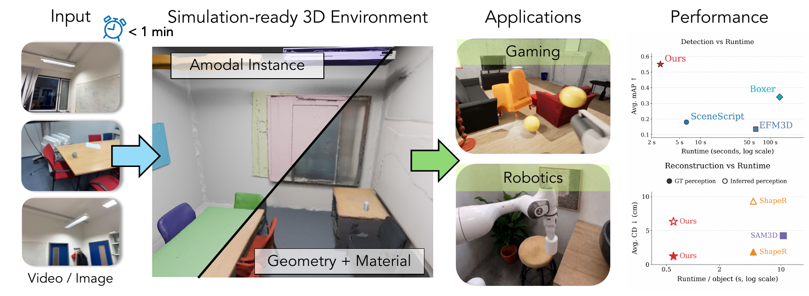
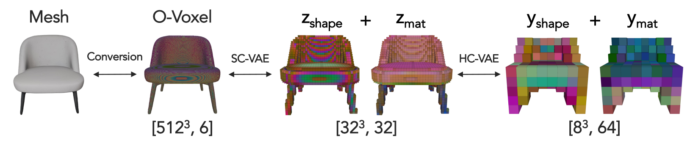
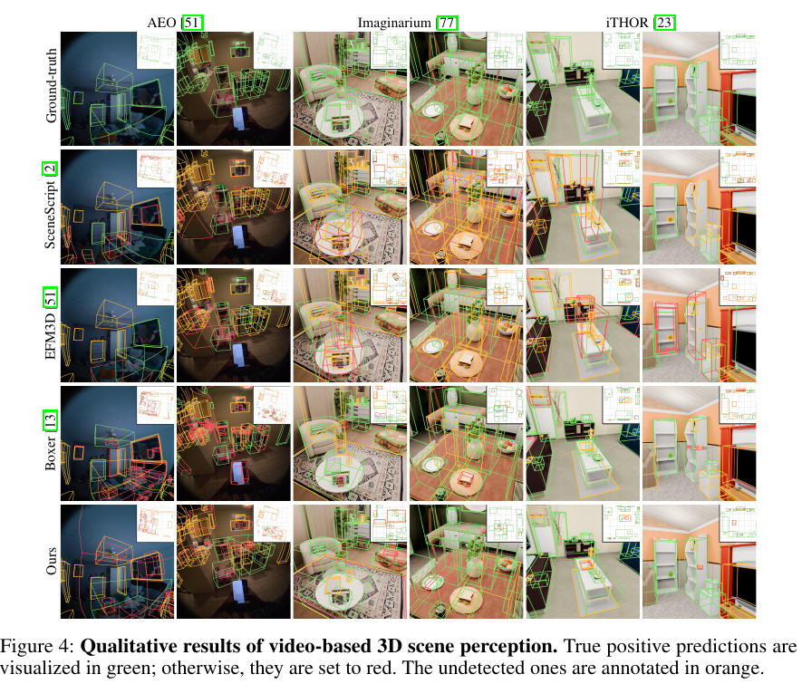
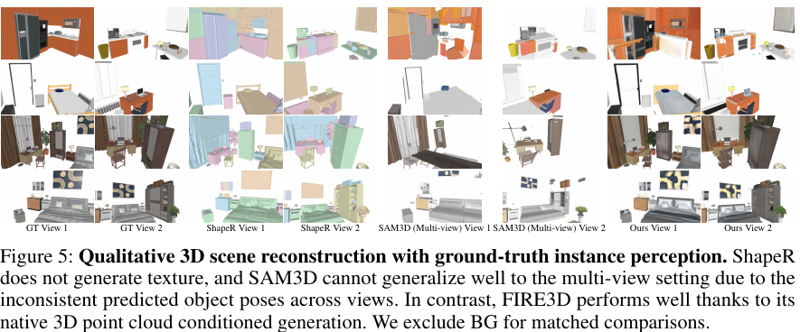
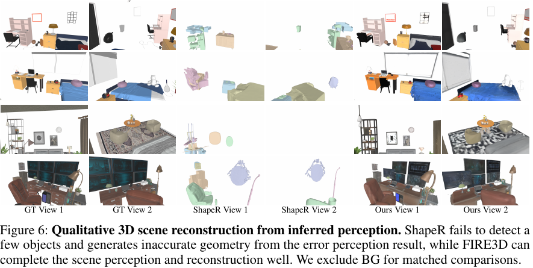
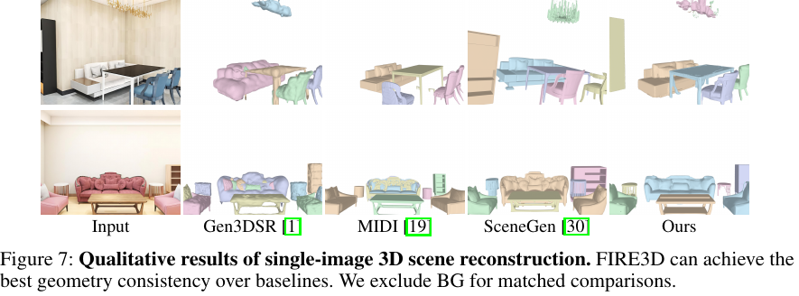
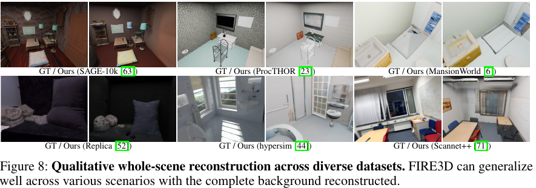

# FIRE3D: Feed-forward Interactive 3D Scene Reconstruction Within A Minute

[Hongchi Xia](https://xiahongchi.github.io/)<sup>1</sup>,
[Tianhang Cheng](https://tianhang-cheng.github.io/)<sup>1</sup>,
[Wei-Chiu Ma](https://www.cs.cornell.edu/~weichiu/)<sup>2</sup>,
[Shenlong Wang](https://shenlong.web.illinois.edu/)<sup>1</sup>

<sup>1</sup> University of Illinois Urbana-Champaign &nbsp;&nbsp;
<sup>2</sup> Cornell University

[GitHub](https://github.com/xiahongchi/Fire3D) |
[Models](https://huggingface.co/hongchi/Fire3D) |
[Inference data](https://huggingface.co/datasets/hongchi/Fire3D)

[](assets/teaser_v3.pdf)

Fire3D is a unified feed-forward framework that transforms a single RGB image
or casual RGB video into simulation-ready 3D scene assets. It predicts a
compositional scene representation with object-level 6-DoF pose, bounding box,
mesh geometry, and texture, without test-time optimization.

This release provides the inference code, model checkpoints, processed example
inputs, and frozen protocols needed to reproduce Fire3D results on iTHOR,
Imaginarium, ScanNet++, and single-image scenes.

## TODO

- [x] Inference code release
- [x] Model release
- [x] Inference data release
- [x] Training code release
- [ ] Training data release

## Installation

The reference environment uses Linux, Python 3.10, CUDA 12.8, PyTorch 2.7.1,
and Blender 4.5.1 LTS. A CUDA-capable NVIDIA GPU is required; the release
protocols were validated on a 96 GB GPU.

```bash
git clone https://github.com/xiahongchi/Fire3D.git
cd Fire3D
bash scripts/install.sh
conda activate fire3d
bash scripts/install_blender.sh
```

`scripts/install.sh` builds the CUDA extensions used by O-Voxel and CuMesh.
Install a CUDA 12.8-compatible NVIDIA driver and a C++ compiler before running
it. DINOv3 is installed at its pinned source revision and remains subject to
the DINOv3 license in `licenses/DINOV3_LICENSE.md`.

## Download

Download the model once and select the dataset examples you want to run:

```bash
fire3d download --models
fire3d download --data --dataset ithor --scene-id iTHOR_FloorPlan312_physics
fire3d download --data --dataset imaginarium --scene-id bedroom_01
fire3d download --data --dataset scannetpp --scene-id 09bced689e
fire3d download --data --dataset single_image --scene-id 003025
fire3d download --evaluation shaper
```

Omit `--scene-id` to download every whitelisted scene in a selected dataset.
Running `fire3d download` without selectors downloads the model and all four
whitelisted processed data subsets. Archives are verified and extracted into:

```text
checkpoints/Fire3D/   # hongchi/Fire3D
data/                 # datasets/hongchi/Fire3D
```

## Inference

Each command below runs perception, object reconstruction, scene composition,
camera sampling, and rendering with a frozen release protocol:

```bash
bash scripts/run_ithor_example.sh
bash scripts/run_imaginarium_example.sh
bash scripts/run_scannetpp_example.sh
bash scripts/run_single_image_example.sh
```

The equivalent unified command accepts another scene from the same downloaded
dataset:

```bash
fire3d infer \
  --dataset ithor \
  --scene-id iTHOR_FloorPlan312_physics \
  --gpu 0
```

Use `--skip-render` when only perception and textured scene meshes are needed.
Outputs are written under `results/<dataset>/<scene-id>/` by default. Every run
records its resolved protocol and exact subprocess commands.

| Dataset | Release example | Input adapter | Protocol |
|---|---|---|---|
| iTHOR | `iTHOR_FloorPlan312_physics` | posed RGB-D video | `fire3d_video_v1` |
| Imaginarium | `bedroom_01` | posed RGB-D video | `fire3d_video_v1` |
| ScanNet++ | `09bced689e` | Pi3 RGB-D sequence with confidence filtering | `fire3d_scannetpp_v1` |
| Single image | `003025` | aligned RGB and point cloud | `fire3d_single_image_v1` |

The iTHOR, Imaginarium, and ScanNet++ protocols enable the background room-box
fit and use its isotropic enclosing transform before background reconstruction.
Single-image inference preserves its separate input-aligned background policy.

The ScanNet++ and single-image protocols use the same batched execution path as
the video protocol: SS/shape/PBR flow batches of 16, VAE decode chunks of 16,
CuMesh batches of 8, parallel UV unwrapping, and power-of-two sparse material
queries. Their dataset-specific sampling and remeshing settings remain frozen.

## Method

[](assets/method_overview.pdf)

Fire3D lifts image features into a shared 3D point cloud, predicts scene
instances and oriented boxes, and reconstructs each object through cascaded
sparse-structure, shape, and PBR flow-matching models. Sparse VAE decoders and
the O-Voxel/CuMesh postprocessor produce individually transformable textured
meshes and a composed scene GLB.

### Hierarchical Compression VAE

[](assets/hcvae.pdf)

Figure 3 shows the Hierarchical Compression VAE (HC-VAE), the compact object
representation that makes scene-level generation practical. TRELLIS.2's
Sparse Compression VAE (SC-VAE) first maps an O-Voxel into sparse shape and
material fields at resolution `32^3` with 32 channels. Fire3D's HC-VAE then
compresses each field into an `8^3` representation with 64 channels, reducing
the latent volume by 32x while preserving the geometry and appearance decoded
by the frozen SC-VAE. The compact shape and PBR latents let Fire3D batch flow
sampling and VAE decoding across many scene instances.

### Released Models

`fire3d download --models` installs the following stable model aliases. Public
filenames intentionally do not encode private training iteration numbers.

| Component | Bundle path | Role |
|---|---|---|
| Scene perception | `perception/model.pt` | Instance validity, 6-DoF pose, OBB, and 3D mask prediction |
| Sparse-structure flow | `reconstruction/flows/ss/model.pt` | Object occupancy-latent generation |
| Shape flow | `reconstruction/flows/shape/model.pt` | HC-VAE shape-latent generation |
| PBR flow | `reconstruction/flows/pbr/model.pt` | HC-VAE material-latent generation |
| Sparse-structure VAE | `reconstruction/vae/ss/ckpts/decoder.pt` | Sparse occupancy decoding |
| Shape HC-VAE | `reconstruction/vae/shape/ckpts/{encoder,decoder}.pt` | Shape-field compression and decoding |
| PBR HC-VAE | `reconstruction/vae/pbr/ckpts/{encoder,decoder}.pt` | Material-field compression and decoding |
| DINOv3 encoder | `external/dinov3_vitl16_pretrain_lvd1689m-8aa4cbdd.pth` | Image feature extraction |
| TRELLIS.2 shape decoder | `external/trellis2/shape_dec_next_dc_f16c32_fp16.safetensors` | SC-VAE shape-field decoding |
| TRELLIS.2 PBR decoder | `external/trellis2/tex_dec_next_dc_f16c32_fp16.safetensors` | SC-VAE material-field decoding |

## Repository Structure

```text
configs/inference/       frozen public inference protocols
configs/training/        released perception, flow, and HC-VAE recipes
fire3d/                  stable command-line and runtime interface
eval/                    perception, reconstruction, and rendering runtime
training/                model training and validation entry points
benchmarks/              frozen geometry and appearance evaluations
baselines/               pinned external-method adapters and contracts
data_processing/         scene/object preprocessing reference pipelines
models/ modules/         Fire3D neural network definitions
utils/                    dataset adapters and geometric utilities
trellis2_x2/             required TRELLIS.2, O-Voxel, and CuMesh runtime
third_party/anyup/       pinned AnyUp feature upsampler
scripts/                 installation, download, and example commands
tests/                   release and protocol validation gates
```

See [docs/release_validation.md](docs/release_validation.md) for the validation
scene matrix and the required release gates.

## Training And Evaluation

The release includes the full model-side training paths for scene perception,
the sparse-structure/shape/PBR flow cascade, and the shape/PBR HC-VAEs. Public
configs retain the architectures, objectives, augmentations, and latent
contracts used for the released models while replacing cluster paths with
explicit environment roots. See [training/README.md](training/README.md).

Perception evaluation and the iTHOR/Imaginarium reconstruction benchmarks are
under `eval/perception/` and `benchmarks/scene_reconstruction/`. A compact,
pickle-free ShapeR GT bundle can be installed with
`fire3d download --evaluation shaper`.

The dataset-processing reference covers SAGE-10K, InternScenes, MansionWorld,
iTHOR, ProcTHOR, SceneSmith, Imaginarium, 3D-FUTURE, ABO, HSSD, and the GitHub
and Sketchfab subsets of Objaverse. It includes scene rendering, transform
export, O-Voxel generation, and sparse latent encoding. Upstream source data is
not redistributed.

Baseline adapters for EFM3D, Boxer, SceneScript, ShapeR, SAM3D Objects,
TRELLIS.2, SimRecon, HoloScene, and LiteReality use pinned upstream revisions;
their repositories and checkpoints remain separate. See
[baselines/README.md](baselines/README.md).

## Results Preview

**Figure 4: Video-based 3D scene perception**



**Figure 5: Reconstruction with ground-truth instance perception**



**Figure 6: Reconstruction from inferred perception**



**Figure 7: Single-image 3D scene reconstruction**



**Figure 8: Whole-scene reconstruction across diverse datasets**



## License

Fire3D code is released under the MIT license. Model weights, datasets, and
third-party components may have separate terms. See
[THIRD_PARTY_NOTICES.md](THIRD_PARTY_NOTICES.md), the Hugging Face model card,
and the Hugging Face dataset card before redistribution or commercial use.

## Citation

Citation metadata will be updated with the paper identifier when available.
For now, use the title and authors in [CITATION.cff](CITATION.cff).

## Acknowledgements

This release builds on DINOv3, AnyUp, TRELLIS.2, O-Voxel, CuMesh,
nvdiffrast, PyTorch3D, and the iTHOR, Imaginarium, and ScanNet++ datasets. We
thank their authors and maintainers.
