# Fire3D WebUI

A Gradio server that turns **one uploaded RGB photo** into a **textured, interactive
3D scene (GLB)**. Start it on a GPU machine, open the page from your laptop, upload
a picture, and download the model.

The WebUI is a thin layer over the released pipeline -- it never re-implements
reconstruction. It converts the upload into a `single_image` protocol scene and
then runs the frozen `fire3d_single_image_v1` protocol through
`fire3d infer`, so a result produced in the browser can always be reproduced
from the command line.

```mermaid
flowchart LR
    A[Upload RGB image] --> B[fit size to 32 px lattice]
    B --> C[monocular depth<br/>Depth Anything V2]
    C --> D[back-project<br/>H/2 x W/2 organized cloud]
    D --> E[room-height scale calib.]
    E --> F[scene dir<br/>rgb.jpeg + aligned_pcd.ply + camera.json]
    F --> G[fire3d infer<br/>fire3d_single_image_v1]
    G --> H[perception: instances, 6-DoF pose, OBB]
    H --> I[SS / Shape / PBR flow + VAE decode]
    I --> J[composed scene GLB + per-object meshes]
```



## Why a depth step exists

The released `single_image` protocol does not consume an RGB image alone. Every
scene ships an organized point cloud:

```
<root>/single_image_valid.txt
<root>/data/<scene_id>/rgb.jpeg             the input frame
<root>/data/<scene_id>/aligned_pcd.ply      (H/2, W/2) lattice, NaN where invalid
<root>/data/<scene_id>/camera.json          the camera the render stage replays
```

Perception lifts DINO features onto that cloud and reconstruction conditions on
it, so an upload needs a cloud before the frozen pipeline can run. The WebUI
estimates metric depth for the upload and back-projects it into the same
gravity-aligned world frame the released scenes use:

* **z is up** -- the wall/floor fit and the room-box prior read the z percentiles.
* **+y is forward** -- the camera sits at the origin looking along +y.
* **metres** -- the conditioning cloud is compared against `scene_scale = 24.0`.

`Depth Anything V2 Metric-Indoor` is the default because it returns metres for
indoor rooms, which is exactly this release's domain. If that checkpoint cannot
be fetched the WebUI falls back to the relative checkpoint and pins the scale
from the reconstructed room height instead.

## Setup

```bash
# Once, on the GPU machine: pyenv interpreter, CUDA extensions, PyTorch,
# DINOv3 source tree, plus gradio and transformers for the WebUI.
FIRE3D_WITH_WEBUI=1 bash scripts/install.sh
source .venv/bin/activate
```

The installer builds `./.venv` from the interpreter pyenv already resolves when
it is Python 3.10/3.11 (`FIRE3D_PYTHON_VERSION` pins an exact build,
`FIRE3D_VENV_DIR` moves the venv). `nvcc` must be on `PATH` or under
`CUDA_HOME`; `scripts/install.sh` checks that, plus git and a C++ compiler,
before downloading anything. `scripts/install_blender.sh` is only needed if you
enable the optional static render preview.

## Run

```bash
fire3d serve                              # http://<server>:7860
bash scripts/run_webui.sh --port 8080     # activates ./.venv itself
python -m fire3d.webui.app --auth user:secret
fire3d serve --gpu 1 --render-preview      # GPU 1, also render stills
```

Useful flags:

| Flag | Meaning |
|---|---|
| `--host`, `--port` | Bind address and port (default `0.0.0.0:7860`) |
| `--auth USER:PASSWORD` | Require HTTP basic auth |
| `--share` | Gradio public tunnel; prefer a reverse proxy in production |
| `--gpu` | `CUDA_VISIBLE_DEVICES` for the inference subprocess |
| `--fov` | Nominal horizontal field of view for the upload (default 60°) |
| `--max-side` | Long-side cap for the upload (default 1280 px) |
| `--render-preview` | Also render stills at the input camera (needs Blender) |
| `--depth-model` | Override the depth checkpoint; `none` selects the flat placeholder |
| `--keep-scenes` | How many WebUI scenes to retain (default 50) |
| `--concurrency` | Concurrent GPU jobs (default 1) |
| `--no-bootstrap` | Verify resources but download nothing at start-up |
| `--example-data` | Also install the released `003025` example scene |

## What start-up downloads

Bootstrap runs before the server accepts traffic and is sentinel-based, so a
restart is a no-op and an interrupted download resumes.

| Resource | Location | Notes |
|---|---|---|
| Fire3D model bundle | `checkpoints/Fire3D` | perception, SS/Shape/PBR flows, HC-VAEs, TRELLIS.2 decoders, DINOv3 weights |
| DINOv3 source | `third_party/dinov3` | pinned commit `31703e4c`; loaded with `torch.hub.load(..., source="local")` |
| Depth checkpoint | `.cache/fire3d_webui/depth/` | Depth Anything V2 Metric-Indoor Small |
| Released example scene | `data/webui/single_image` | only with `--example-data` |

The compiled CUDA extensions (`trellis2`, `cumesh`, `o_voxel`, `flex_gemm`,
`nvdiffrast`, `utils3d`, `spconv`) cannot be downloaded -- they have to be built
by `scripts/install.sh`. The bootstrap **verifies** them and reports precisely
what is missing; the resource panel in the UI shows the same report, and
`outputs/webui/bootstrap.json` records it for an unattended start.

## Server deployment

```bash
# Long-running service
nohup fire3d serve --host 0.0.0.0 --port 7860 --auth user:secret \
  > outputs/webui/server.log 2>&1 &

# Port-forward to your laptop when the server is only reachable over SSH
ssh -N -L 7860:127.0.0.1:7860 user@gpu-host
# then open http://127.0.0.1:7860
```

Notes for a shared deployment:

* Set `--auth` (or put an authenticating proxy in front). The queue is
  serialized by default; raise `--concurrency` only if the GPU has headroom.
* Bind to `127.0.0.1` and terminate TLS in nginx/Caddy when exposing the server.
* Scenes live in `data/webui/single_image`, outputs in `outputs/webui/<scene_id>`;
  retention prunes only WebUI-prefixed scenes, never a released example scene.

## Environment variables

Every flag has an environment equivalent, plus a few that only exist as
variables:

| Variable | Default |
|---|---|
| `FIRE3D_WEBUI_HOST` / `FIRE3D_WEBUI_PORT` | `0.0.0.0` / `7860` |
| `FIRE3D_WEBUI_AUTH` | unset (`USER:PASSWORD`) |
| `FIRE3D_WEBUI_GPU` | `0` |
| `FIRE3D_WEBUI_SCENE_ROOT` | `data/webui/single_image` |
| `FIRE3D_WEBUI_OUTPUT_ROOT` | `outputs/webui` |
| `FIRE3D_WEBUI_CACHE_ROOT` | `.cache/fire3d_webui` |
| `FIRE3D_WEBUI_DEPTH_MODEL` | `depth-anything/Depth-Anything-V2-Metric-Indoor-Small-hf` |
| `FIRE3D_WEBUI_DEPTH_DEVICE` | `auto` |
| `FIRE3D_WEBUI_RENDER_PREVIEW` | `0` |
| `FIRE3D_WEBUI_MAX_SIDE` / `FIRE3D_WEBUI_FOV` | `1280` / `60` |
| `FIRE3D_WEBUI_MAX_DEPTH` / `FIRE3D_WEBUI_MIN_DEPTH` | `12.0` / `0.05` |
| `FIRE3D_WEBUI_CALIBRATE_ROOM_HEIGHT` | `1` |
| `FIRE3D_WEBUI_TARGET_ROOM_HEIGHT` | `2.6` |
| `FIRE3D_WEBUI_KEEP_SCENES` / `FIRE3D_WEBUI_CONCURRENCY` | `50` / `1` |
| `FIRE3D_MODEL_ROOT` | `checkpoints/Fire3D` |
| `FIRE3D_DINOV3_REPO` | `third_party/dinov3` |

## Outputs

```
outputs/webui/<scene_id>/
  logs/webui_infer.log                     the WebUI's own run log
  logs/perception.log, logs/reconstruction_batch.log, ...
  summary.json                             per-scene status
  resolved_protocol.json                   frozen protocol + resolved subprocess commands
  reconstruction/<scene_id>/appearance/predicted_textured_world_scene.glb   <- the scene
  reconstruction/<scene_id>/objects/pred_*.ply                                <- per object
  manifests/, perception/<dataset>/        intermediate stage outputs
  renders/                                 static previews when --render-preview is on
```

`predicted_textured_world_scene.glb` is the interactive result the UI shows.
The driver also writes `predicted_textured_training_scene.glb` in the normalized
frame; the WebUI only falls back to it when the world GLB is absent.

## Reproducing a browser run by hand

The WebUI records everything it did, so any run can be repeated at the shell:

```bash
# 1. the scene the WebUI generated
ls data/webui/single_image/data/<scene_id>/

# 2. exactly the command the WebUI ran
python -m fire3d infer \
  --dataset single_image \
  --scene-id <scene_id> \
  --data-root data/webui \
  --output-root outputs/webui/<scene_id> \
  --gpu 0
```

Drop `--skip-render` to render stills (needs Blender); adding
`--allow-protocol-overrides` plus `--geometry-arg` turns the run into a recorded
ablation instead of a protocol reproduction.

## Tips for good results

* Use an indoor photo with a visible floor and ceiling -- the room-box prior and
  the wall fit both depend on them.
* Shoot roughly level; the nominal field of view cannot recover a tilted camera.
* Set `--fov` to the real value if you know it (a phone's main camera is around
  65-70°; webcams are usually narrower). It trades scene proportions against
  depth extent.
* Raise `--max-side` for thin structures; lower it to cut latency and memory.

## Troubleshooting

| Symptom | Cause |
|---|---|
| `推理运行时` reports missing modules | `scripts/install.sh` was not run (or failed) on this machine |
| `WebUI 依赖` reports missing gradio | `python -m pip install -e ".[webui]"` |
| Depth step fails with a `transformers` error | run the extra install; the depth checkpoint needs `transformers>=4.49` |
| `深度估计没有得到足够的有效点` | the upload has no usable depth (flat texture, extreme crop); try another photo |
| Reconstruction is marked failed | read `outputs/webui/<scene_id>/logs/reconstruction_batch.log`; the UI shows the log tail |
| Render preview fails | Blender is missing: `bash scripts/install_blender.sh`, or turn the preview off |
| Every request re-loads models slowly | expected: each request is one process, and the cascade is loaded per process |
